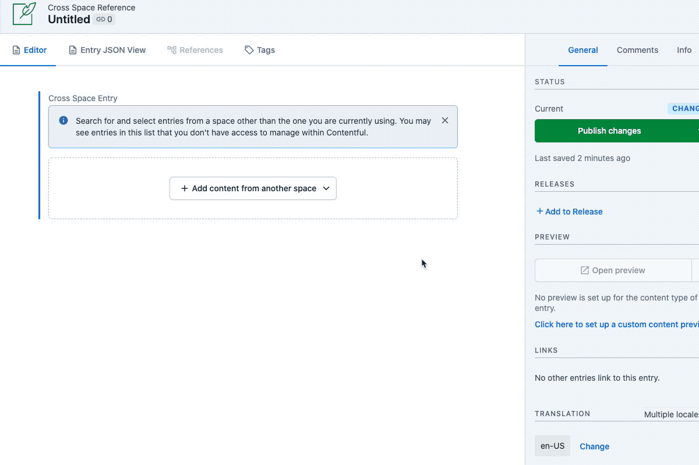
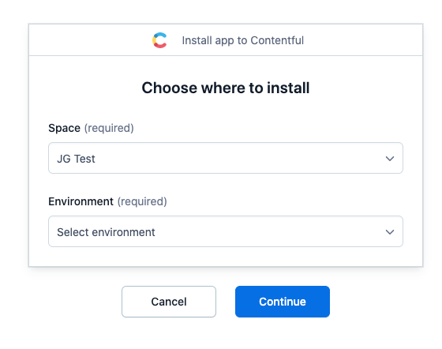
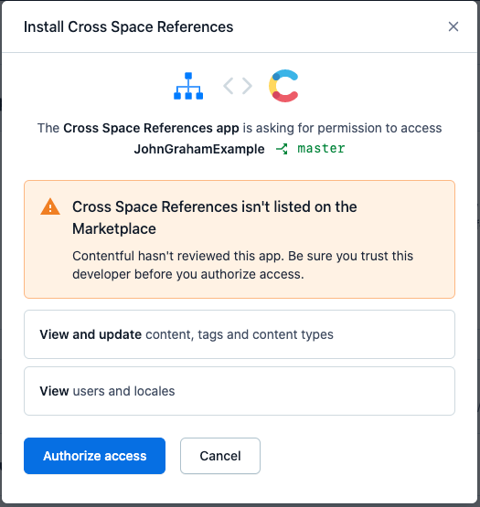
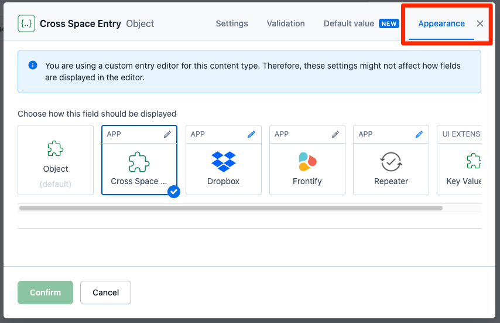

# Contentful Cross Space References

Contentful Cross Space References is a simple app that makes it easy to create a relationship between content in multiple Contentful spaces via the Contenful UI: 



---

## Installation

To use this app in your spaces, follow the below steps:
1. [Install the app to your space](https://app.contentful.com/deeplink?link=apps&id=1gIm0dTkt9n2mRaY7Shsc7)
2. Select the Space and Environment that you want to install the app in, then select "Continue" to be redirected to the Apps page in the selected space/environment: \
   
3. Select "Authorize access" to allow Cross Space References app to access your space, after which you'll be redirected to the App Configuration screen: \
    
4. This app will only be able to be installed after you've defined at least one external space from which you'd like to create relationships to this space's content, so select the "Add Space Configuration" button: \
   
5. In the modal window, enter a Space ID and Content Delivery API token that will be used to retrieve Content from your external space as seen here
   (_Note: you will be unable to save this configuration if the Space ID and Token are invalid._): \
   . 
6. Select Save in the modal window, at which point you'll see the external space listed in your App Configuration: \
   
7. Select "Install".
   1. _Note: Additional external spaces can be added after installation by returning to this screen via the App tab -> Manage Apps_
   2. _From the Apps management page, selecting the dropdown menu to the right of your Cross Space Configuration app and choose the Configure option._
   3. _Once back in the App Configuration Screen, you can add a new space configuration and select "Save" to update your new configurations._
   4. _You can also install this app in additional spaces from the App Managment tab of those spaces by selecting the Cross Space References app from the list of Available apps, then following steps 3-7 above.


### Configuring your Content Types
1. For every Content Type you'd like to be able to reference content from an external space, create a new "JSON Object" field, then set the appearance for this field to use the Cross Space Reference App: \
   

## JSON Field Output
When using the Cross Space References app, the reference will be stored as a JSON object with the following structure: 

```json
{
    "sys": {
        "type": "Link",
        "linkType": "CrossSpaceEntry",
        "id": "<entry-id>",
        "space": {
            "sys": {
                "type": "Link",
                "linkType": "Space",
                "id": "<space-id>"
            }
        }
    }
}
```

To retrieve the entry data, make an API call to the appropriate space and query by entry id as described in our documentation: [Getting a single entry](https://www.contentful.com/developers/docs/references/content-delivery-api/#/reference/entries/entry/get-a-single-entry/console/curl)

---
# Contributing

To contribute back, fork this project and clone the repo, then run `npm install` in your local directory. 

This project was bootstrapped with [Create Contentful App](https://github.com/contentful/create-contentful-app). 

## Available Scripts

In the project directory, you can run:

#### `npm start`

Creates or update your app definition in contentful, and runs the app in development mode.
Open your app to view it in the browser.

The page will reload if you make edits.
You will also see any lint errors in the console.

#### `npm run build`

Builds the app for production to the `build` folder.
It correctly bundles React in production mode and optimizes the build for the best performance.

The build is minified and the filenames include the hashes.
Your app is ready to be deployed!

## Create the App Definition
1. Create a new app definition as described in [Building your first app](https://www.contentful.com/developers/docs/extensibility/app-framework/tutorial/#create-your-appdefinition).
2. Give your app a name (such as Cross Space References).
3. Configure your app:
   1. Set the frontend url of your app to the local development url from `npm run start` (http://localhost:3000 by default), or Select "Hosted by Contentful" and upload the output of `npm run build` 
   2. Select the checkboxes for "App Configuration Screen" and "Entry Field", then select the checkbox for "JSON Object" below "Entry Field"
4. Select "Save", then select "Save" in the confirmation modal that appears.

## Configure and Install the App to your Space
1. From the App Definition window, select the down arrow next to "Actions", then select "Install to space".
2. Select a Space and Environment where you'd like to install this app in the modal window that appears, then select "Continue".
3. Authorize the Cross Space References app for your space, after which you'll be redirected to the App Configuration screen, as seen here: \
   
4. Follow installation steps above, beginning with step 4.

## Create a PR
Make any necessary changes then submit a PR to contribute the changes back to CF.
